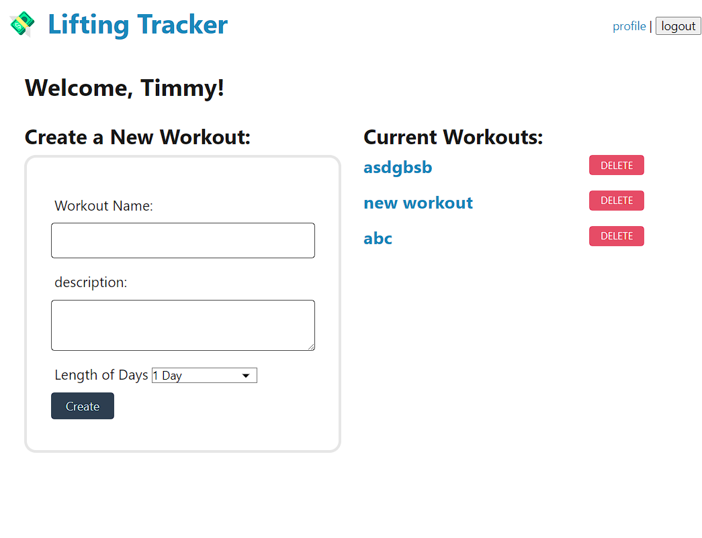

# Lifting Tracker

## Deployed Site

https://glacial-plains-60902-a8f57794eb9b.herokuapp.com/

## Description

This is a full stack project written and developed by Yoon-Jae Kim, Brian Klein, and Logan Rehberg. Parts of the code here were lifted from the Mini-Project of Module 14 of the NW Coding Bootcamp. We also used code from these two sources to add a Handlebar Helper function and an Elevator model, respectively.

https://gist.github.com/tracend/7522125
https://github.com/tholman/elevator.js

The purpose of this was project is to solidfy the MVC model concept by having us create a fully functional website from scratch. The website is a simple workout tracker that allows users to login, sign up, post their workouts, and add exercises to said workouts

The Models for this project boil down to three separate tables, Users, Workouts, and Exercises. The Views are handled by Handlebar and pull Models via the Controller, handled by Express.

Users will login, add workout from the profile page, then edit their workout by adding or deleting exercises from the workout. Exercises are tied to each user's workout and users cannot edit other users' creations.

The length of the page can get pretty lengthy, so we used the elevator model from @tholman to enable the user to scroll back up to the top of the page in a fun way. It plays catchy muzak as well!

## Table of Contents

- [Installation](#installation)
- [Usage](#usage)
- [Credits](#credits)
- [License](#license)
- [How to Contribute](#how-to-contribute)
- [Tests](#tests)

## Installation

You can demo this project by following the deployed heroku link. Another option would be to clone this onto your local machine and run it after seeding the database and installing the necessary packages using 'npm run seed' and 'npm i', respectively. Please be sure to have MySQL running and to fill out the .env file with your db credentials before you do so.

## Usage

This project can be used by anyone looking to streamline their README creation process.

## Credits

### Github

[Yoonbacca](https://github.com/Yoonbacca)

### Email

[yoonjaekim3@gmail.com](yoonjaekim3@gmail.com)

## License

None

## How to Contribute

This is a student project and does not require contributions at this time. Feel free to fork and add your adjustments as needed.
